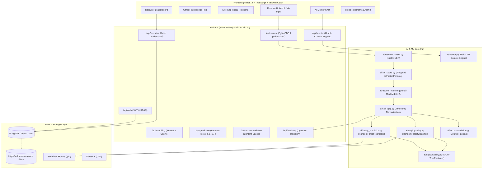

# System Architecture & Technical Specification

The **AI Career Intelligence Platform** is a full-stack, machine learning and NLP-driven system engineered to analyze candidate resumes, evaluate real ATS compliance, measure dense semantic job matching, predict hiring placement and market compensation, compute skill gap vectors, and deliver personalized career mentoring.

---

## Technical Pipeline Breakdown

### 1. Ingestion & Invariant Parsing
- **PDF & Word Parsing:** `PyMuPDF` extracts page-by-page vector text from PDFs; `python-docx` unpacks XML paragraph structures and tabular grids.
- **Entity Extraction:** spaCy `en_core_web_sm` coupled with pattern heuristics extracts:
  - Full Name, Email, Telephone, LinkedIn, GitHub.
  - Normalized skills (categorized into technical vs. soft skills).
  - Degree levels, universities, graduation years.
  - Work history (companies, roles, dates, calculated tenure).
  - Production projects, credentials, and certifications.
- **Defensive Design:** Missing fields produce default types (empty arrays, clean strings) rather than raising unhandled exceptions.

### 2. Weighted ATS Scoring Engine
ATS compliance is computed dynamically using the exact weighting:
$$\text{Score}_{\text{ATS}} = 0.25 K + 0.25 S + 0.20 E + 0.15 D + 0.10 Q + 0.05 F$$
- $K$ (Keyword Match, 25%): Term frequency overlap of job description n-grams against the resume body.
- $S$ (Skills Match, 25%): Coverage ratio of required technical and soft competencies.
- $E$ (Experience Relevance, 20%): Tenure comparison vs target seniority, enriched by quantifiable metrics ($M, %, k$).
- $D$ (Education Match, 15%): Degree verification against required threshold.
- $Q$ (Structure Quality, 10%): Core section completeness.
- $F$ (Formatting & Readability, 5%): Word count density and layout readability.

### 3. SBERT Semantic Matching
- Dense semantic vector embeddings using `all-MiniLM-L6-v2` (`sentence-transformers`).
- Embeddings are generated for the candidate resume and job description text.
- Cosine similarity produces the true semantic match percentage, distinguishing between superficial keyword repetition and genuine domain alignment.

### 4. Machine Learning Models & SHAP Explainability
- **Employability Classification:**
  - Model: `RandomForestClassifier(n_estimators=120, max_depth=9)`
  - Features (10): Programming skills, ML skills, SQL proficiency, Cloud skills, Projects count, Certifications count, Experience years, Education tier, ATS score, Resume match score.
  - Performance: **88.25% Accuracy**, **0.9628 ROC-AUC**, **87.47% F1 Score**.
- **Salary Compensation Regression:**
  - Model: `RandomForestRegressor(n_estimators=150, max_depth=12)`
  - Features (8 base, one-hot encoded): Experience years, Education tier, Skills count, Job role, Location tier, Certifications, Projects, Technical expertise index.
  - Performance: **R² = 0.9574**, **MAE = $7,127.24**.
- **SHAP Explainability:**
  - `shap.TreeExplainer` decomposes predictions into additive feature contributions, identifying top drivers (positive and negative) for full model transparency.

### 5. Content-Based Course Recommendation & Career Roadmap
- **Course Matching:** Content-based similarity scoring against candidate's specific missing skills, career objective, and experience level across curated courses from Coursera, Udemy, Harvard, and DeepLearning.AI.
- **Dynamic Roadmap:** Month-by-month trajectory partitioning missing competencies into sequential learning phases, practical projects, and industry credentials.

### 6. AI Career Mentor & Interview Intelligence
- Contextual career mentor with full candidate context (background, ATS score, skill gaps, target role).
- Connects to Anthropic Claude (`claude-3-5-sonnet`), OpenAI, or Gemini via API keys, backed by an intelligent local context reasoning engine when API keys are unconfigured.
- Generates tailored interview questions across 4 distinct categories:
  1. HR / Motivational Screening
  2. Technical Deep-Dive
  3. Project-Based (grounded in actual candidate projects)
  4. Behavioral (STAR method)
